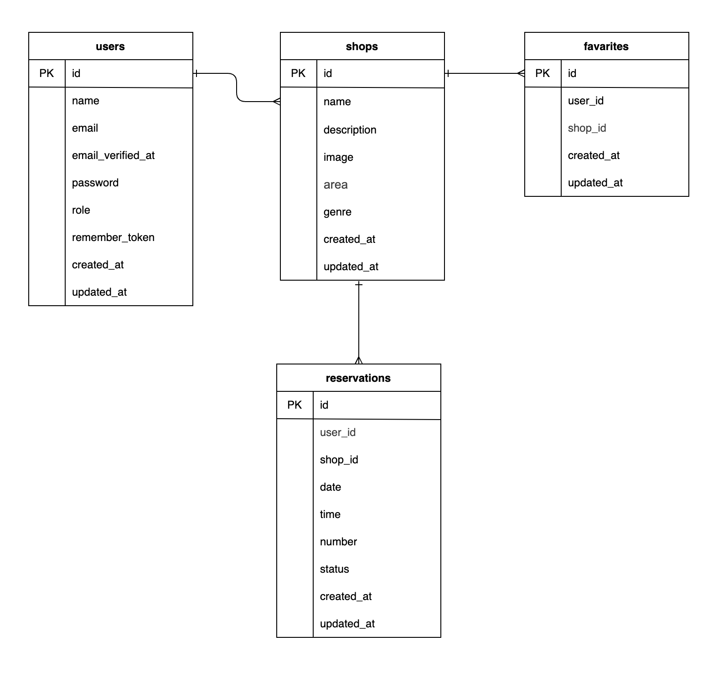

# **アプリケーション名**

rese-app

## **プロジェクト概要**

このアプリケーションは、飲食店の予約・管理を目的とした飲食店予約アプリです。

### **主な機能**

---

## **環境構築**

### **Docker ビルド**

1. リポジトリをクローン:

   ```bash
   git@github.com:shun1019/rese-app.git
   cd rese-app
   ```

2. DockerDesktop アプリを立ち上げる:

   ```bash
   docker-compose up -d --build
   ```

3. (Mac の M1/M2 チップでエラーが発生する場合)

   - 以下の設定を `docker-compose.yml` に追加してください:

   ```yaml
   mysql:
     platform: linux/amd64
   phpmyadmin:
     platform: linux/amd64
   mailhog:
     platform: linux/amd64
   ```

4. (MailHog を追加したい場合)
   - 以下の設定を `docker-compose.yml` に追加してください:
   ```yaml
   services:
     mailhog:
       image: mailhog/mailhog
       container_name: mailhog
       ports:
         - "1025:1025"
         - "8025:8025"
   ```

---

### **Laravel 環境構築**

1. PHP コンテナに入ります:

   ```bash
   docker-compose exec php bash
   ```

2. 依存関係をインストール:

   ```bash
   composer install
   ```

3. `.env` ファイルを作成:

   ```bash
   cp .env.example .env
   ```

4. 環境変数を設定・追加:

   ```env
   DB_CONNECTION=mysql
   DB_HOST=mysql
   DB_PORT=3306
   DB_DATABASE=laravel_db
   DB_USERNAME=laravel_user
   DB_PASSWORD=laravel_pass

   MAIL_MAILER=smtp
   MAIL_HOST=mailhog
   MAIL_PORT=1025
   MAIL_USERNAME=null
   MAIL_PASSWORD=null
   MAIL_ENCRYPTION=null
   MAIL_FROM_ADDRESS=example@example.com
   MAIL_FROM_NAME="${APP_NAME}"

   ```

5. アプリケーションキーを生成:

   ```bash
   php artisan key:generate
   ```

6. マイグレーションを実行:

   ```bash
   php artisan migrate
   ```

7. シーディングを実行:

   ```bash
   php artisan db:seed
   ```

8. キャッシュクリア:

   ```bash
   php artisan config:clear
   php artisan cache:clear
   php artisan route:clear
   php artisan view:clear
   ```

9. ストレージへのシンボリックリンクを作成

```bash
php artisan storage:link
```

10. テストの実行

```bash
php artisan test
```

---

## **ログイン情報**

### **管理者ユーザー**

- メールアドレス: `admin@example.com`
- パスワード: `password`

### **一般ユーザー**

- メールアドレス: `user@example.com`
- パスワード: `password`

これらのアカウントは、データベースのシーディング時に自動的に作成されます。
管理者ユーザーはすべての勤怠データを管理・修正することが可能で、
一般ユーザーは自身の勤怠データのみを管理できます。

---

### **メール認証（MailHog の使用）**

このアプリケーションでは、メール認証に **MailHog** を使用します。

#### **MailHog の起動手順**

Docker コンテナを起動すると、MailHog も自動的に起動します。
特別な設定なしで、以下の URL からメールの確認ができます。

- MailHog 管理画面: http://localhost:8025

#### **メール確認手順**

1. ユーザー登録を行う
2. MailHog にアクセス: http://localhost:8025
3. 受信ボックスにメールが届いていることを確認
4. 認証メール内のリンクをクリックしてアカウントを有効化

---

## 使用技術(実行環境)

- PHP 7.4.9
- Laravel 8.83.8
- Docker
- MySQL 8.0.26
- Laravel Fortify: 1.19
- MailHog

## ER 図



## URL

- 開発環境: [http://localhost/]
- phpMyAdmin: [http://localhost:8080/]
- MailHog: [http://localhost:8025]
